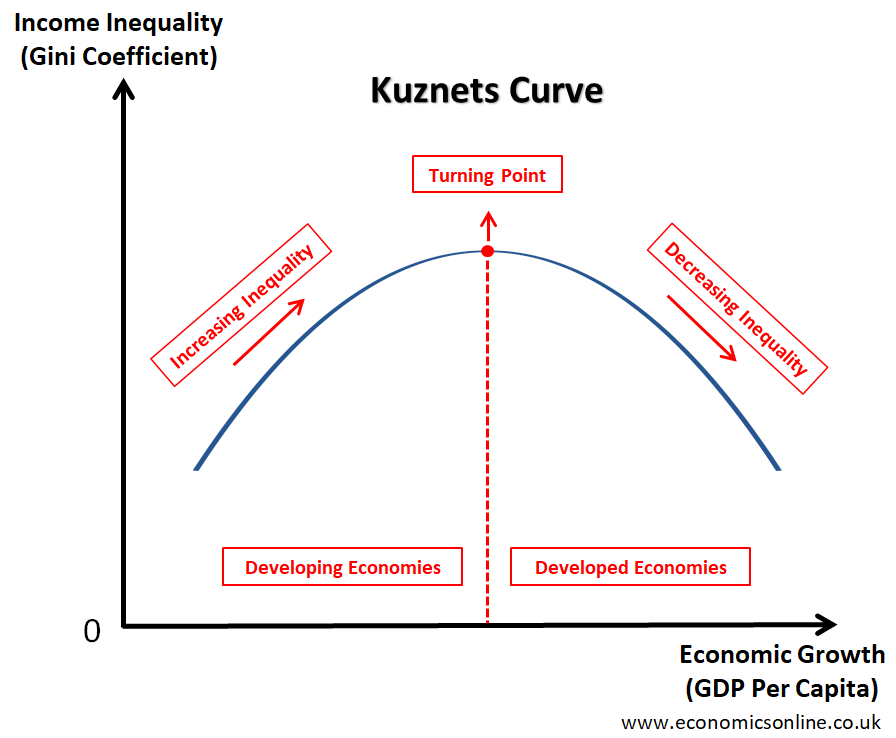

------------------------------------------------------------------------


```{=tex}
\newpage
\tableofcontents 
\newpage
\listoftables 
\newpage
\listoffigures 
\newpage
```

## github repository
https://github.com/yangeline/YangMartinezAlvarezPang.git

```{r setup, include=FALSE}
knitr::opts_chunk$set(tidy.opts=list(width.cutoff=60), tidy=TRUE)
# Set your working directory
getwd()

# Load your packages
library(rvest)
library(scales)
library(dataRetrieval)
library(tidycensus)
library(ggplot2)
library(forecast)
library(tidyverse)
library(dplyr)
library(tidyr)
library(trend)
library(zoo)
library(lubridate)
library(here)
library(cowplot)
#install.packages(rio)
library(rio)
#install.packages("readxl")
library(readxl)

# Set your ggplot theme
project_theme <- theme_light(base_size = 12) +
                theme(axis.text = element_text (color = "green"), legend.position = "bottom")

# Load your datasets
here()

##Datasets for NC Emissions for 1970-2021 (by source)
NC_Emissions <- read_excel("../YangMartinezAlvarezPang/Data/Raw Data/NC_Emissions.xlsx")
colnames(NC_Emissions) <- NC_Emissions[3, ]
NC_Emissions <- NC_Emissions[-(1:3), ]
write.csv(NC_Emissions, "../YangMartinezAlvarezPang/Data/Raw Data/NC_Emissions.csv")
NC_Emissions_csv <- read.csv("./Data/Raw Data/NC_Emissions.csv", stringsAsFactors = TRUE)

##Dataset State energy-related carbon dioxide emissions by year (1970–2021)
States_Emissions <- read_excel("../YangMartinezAlvarezPang/Data/Raw Data/State Data.xlsx")
colnames(States_Emissions) <- States_Emissions[4, ]
write.csv(States_Emissions, "../YangMartinezAlvarezPang/Data/Raw Data/State Data.csv")
States_Emissions <- read.csv("./Data/Raw Data/State Data.csv", skip = 4, stringsAsFactors = TRUE)

###We kept only three years
State_Emissions_processed <- States_Emissions %>%
  select(State, X2009, X2019, X2021) %>%
  na.omit()
colnames(State_Emissions_processed) <- c("State","Emission 2009", "Emission 2019", "Emission 2021")

## We wanted to visualize the relation between growth (considering the indicator log GDP per capita) and CO2 emissions (taking the data for energy-related carbon dioxide emissions by year). We have the emissions ready to exploit, but once we have the information for GDP, we would need to do some estimations to get the log GDP per capita and make a smoother comparison between our variables.

###1 GDP by state for 1997-2022
GDP_States <- read.csv("../YangMartinezAlvarezPang/Data/Raw Data/GDP.csv", stringsAsFactors = TRUE)

###2 We kept data only for 3 years and named the columns
GDP_States_Selectedperiod <- GDP_States %>%
  select(Years, X2021, X2019, X2009)
  colnames(GDP_States_Selectedperiod) <- c("State","GDP2021", "GDP2019", "GDP2009")

###3 We got the data for population by state (2009 and 2019), from Fred, following the next steps: 
####Created the scrapping function 
scraping <- function(Year) {
  the_URL <- paste0('https://fred.stlouisfed.org/release/tables?rid=118&eid=259194&od=', Year, '-01-01#')
  population_website <- read_html(the_URL)

####Scraping data from the given website  
State <- population_website %>% html_nodes(".fred-rls-elm-nm-td") %>% html_text(trim=T)
Population <- population_website %>% html_nodes(".fred-rls-elm-nm-td+ .fred-rls-elm-vl-td") %>% html_text(trim=T)
Year <- population_website %>% html_nodes("#table-unit-subheading1") %>% html_text(trim=T)

####Putting the data into data frame
StatePopulation_scraping <- data.frame(
  State = State,
  Population = Population)
StatePopulation_scraping
}

####we extracted the data for 3 years
StatePop_2021 <- scraping('2021')
StatePop_2021

StatePop_2019 <- scraping('2019')
StatePop_2019

StatePop_2009 <- scraping('2009')
StatePop_2009

#### We merged the dataframes and named columns
StatesPop_2009_2019 <- merge(StatePop_2009, StatePop_2019, by = "State")
threeYears_StatePop <- merge(StatesPop_2009_2019, StatePop_2021, by = "State")
colnames(threeYears_StatePop) <- c("State","P2009", "P2019", "P2021")

####We converted the population data into numeric values and cleaned the dataframe
threeYears_StatePop <- threeYears_StatePop %>% 
  mutate(Pop2009 = as.numeric(gsub(",", "", P2009)), Pop2019 = as.numeric(gsub(",", "", P2019)), Pop2021 = as.numeric(gsub(",", "", P2021))) %>%
   mutate(Pop2009 = Pop2009*1000, Pop2019 = Pop2019*1000, Pop2021 = Pop2021*1000)%>%
select(State, Pop2009, Pop2019, Pop2021)

```

# Rationale and Research Questions

Rationale The urgency of climate change, propelled by rising levels of
CO2 emissions, necessitates a detailed understanding of emission
sources, patterns, and impact. Energy consumption, particularly the
burning of fossil fuels for electricity, heat, and transportation, is a
significant contributor to global CO2 emissions. 

Understanding these emissions on a granular level, such as by state and sector, 
is critical for developing effective mitigation strategies. North Carolina, like
many states, faces its unique challenges and opportunities in managing
CO2 emissions due to its specific industrial activities, energy mix, and
policy environment. 

Given the vast amount of data available, there's a
pressing need for analytical tools that can simplify this complexity
into actionable insights. By leveraging R, a powerful tool for data
analysis, this project aims to provide a comprehensive analysis of North
Carolina's CO2 emissions within the wider context of the United States,
identifying key areas for policy intervention and technological
innovation.

Research Questions

1.  What are the primary sources of CO2 emissions in North Carolina, and
    how do these compare with national trends?

2.  Which policies and technologies have contributed to increases or
    decreases in CO2 emissions within North Carolina, and how can these
    be applied or modified for better results?

or 2. How do CO2 emissions in North Carolina vary by sector
(residential, commercial, industrial, and transportation), and what
trends can be identified over time?

\newpage

# Dataset Information

In an attempt to rationalize why despite of having a few fossil fuel resources, no coal production, and being one of the United States' leading nuclear power-producing states, North Carolina ranked 13 in 2021 in Total Carbon Dioxide Emissions, according to the US Energy Information Administration (EIA). According to the available data, this paper uses EIA's data for State's energy-related carbon dioxide emissions and their main sources by sector and fossil fuel. We chose the years *2009 and 2019* to analyze changes in emissions's patterns in the decade previous to the pandemic. 

We also define a comparable state in the US in terms of economic growth, taking both Gross domestic product (GDP) and the GDP per capita as indicators, we contrast their emission sources, patterns, and policy interventions, and see how North Carolina performs as Co2 emissioner when considering its economic size. We used the GDP data by state, gathered by USAFacts from the US Bureau of Economic Analysis, while we estimate the State GDP per capita, using that information and the population data was taken from the Federal Reserve Bank of St. Louis (FRED).

\newpage

# Exploratory Analysis

The Environmental Kuznets Curve (EKC) is the graph representation of the hypothesized relationship between income and environmental degradation as an economy grows. According to it, at early stages of economic growth, environmental degradation, and pollution increase but eventually, the relationship reverts so that at high-income levels the economic growth leads to environmental improvement (Leal, 2022). Thus, the EKC has an inverted U-shaped (figure below). Although this idea has been promoted as a method of improving the environment, EKC is not only dependent on economic growth, policy interventions have to be taken for environmental improvement to happen.



```{r}

States_GDP <- merge(GDP_States_Selectedperiod, threeYears_StatePop, by = "State")

#We estimated the LogGDP per capita
logGDP <- States_GDP %>%
  mutate(LogGDP2009 =  log(GDP2009), LogGDP2019 = log(GDP2019)) %>%
  na.omit() %>%
  select(State, LogGDP2009, LogGDP2019)

#We merge the emissions and log gdp per capita datasets
GDP_Emission1 <- merge(logGDP, State_Emissions_processed, by = "State")%>%
  select(-"Emission 2021")%>%
  relocate(State, LogGDP2009, `Emission 2009`, LogGDP2019, `Emission 2019`)
write.csv(GDP_Emission1, "../YangMartinezAlvarezPang/Data/Processed Data/GDP_Emissions1_processed.csv")

#2009 highlighting NC
highlight_NC2009 <- data.frame( GDP = 26.7422380550375, Co2E = 132.990869421698, State = "North Carolina")
highlight_Mas2009 <- data.frame( GDP = 26.690706098084, Co2E = 70.3946850842819, State = "Massachusetts")

logGDP_Emissions_2009plot <- ggplot(GDP_Emission1, aes(x = `LogGDP2009`, y = `Emission 2009`, color = State)) + 
  geom_point(alpha=0.5, size= 1) + 
  ylim(0, 200)+
  ggtitle("CO2 Emissions by log GDP. US States 2009") + 
  xlab(expression(paste("Log GDP"))) + 
  ylab(expression(paste("Co2 Emission"))) + 
  geom_smooth(method = "lm", se = FALSE, color = "lightgrey")+
  theme(legend.position = "none")+
  geom_point(data = highlight_NC2009, aes(x = GDP, y = Co2E, color = State), size = 1, shape = 15, color = "red")+
  geom_label(data = highlight_NC2009, aes(x = GDP+.005, y = Co2E+10, label = "NC"), size = 3)+
  geom_point(data = highlight_Mas2009, aes(x = GDP, y = Co2E, color = State), size = 1, shape = 15, color = "green")+
  geom_label(data = highlight_Mas2009, aes(x = GDP-.005, y = Co2E+10, label = "Massachusetts"), size = 3)
print(logGDP_Emissions_2009plot)

```

```{r}
#plotting for log GDP
#2019 highlighting NC
highlight_NC2019 <- data.frame( GDP = 27.1110218762549, Co2E = 122.620087452089, State = "North Carolina")
highlight_Mas2019 <- data.frame( GDP = 27.1032261573, Co2E = 63.3382579574981, State = "Massachusetts")

logGDP_Emissions_2019plot <- ggplot(GDP_Emission1, aes(x = `LogGDP2019`, y = `Emission 2019`, color = State)) + 
  geom_point(alpha=0.5, size= 1) + 
  ylim(0, 230)+
  ggtitle("CO2 Emissions by log GDP. US States 2019") + 
  xlab(expression(paste("Log GDP"))) + 
  ylab(expression(paste("Co2 Emission"))) + 
  geom_smooth(method = "lm", se = FALSE, color = "lightgrey")+
  theme(legend.position = "none")+
  geom_point(data = highlight_NC2019, aes(x = GDP, y = Co2E, color = State), size = 1, shape = 15, color = "red")+
  geom_label(data = highlight_NC2019, aes(x = GDP+.005, y = Co2E+10, label = "NC"), size = 3)+
  geom_point(data = highlight_Mas2019, aes(x = GDP, y = Co2E, color = State), size = 1, shape = 15, color = "green")+
  geom_label(data = highlight_Mas2019, aes(x = GDP-.005, y = Co2E+10, label = "Massachusetts"), size = 3)
print(logGDP_Emissions_2019plot)

```

```{r}
#From the dataframes created in the previous chunk, we estimated the log GDP percapita and then plot the CO2 emissions by this indicator, to observe if NC is performing above or below the trendline.
GDP_percapita <- merge(GDP_States_Selectedperiod, threeYears_StatePop, by = "State")

#We estimated the LogGDP per capita
logGDP_pc_States <- GDP_percapita %>%
  mutate(GDP_pc_2021 = GDP2021 / Pop2021, GDP_pc_2019 = GDP2019 / Pop2019, GDP_pc_2009 = GDP2009 / Pop2009) %>%
  mutate( LogGDP2009 =  log(GDP_pc_2009), LogGDP2019 = log(GDP_pc_2019), 
          LogGDP2021 = log(GDP_pc_2021)) %>%
  na.omit() %>%
  select(State, LogGDP2009, LogGDP2019, LogGDP2021)

#We merge the emissions and log gdp per capita datasets
StatesGDP_pc_Emission2 <- merge(logGDP_pc_States, State_Emissions_processed, by = "State")
write.csv(StatesGDP_pc_Emission2, "../YangMartinezAlvarezPang/Data/Processed Data/GDP_pc_Emissions_processed.csv")
```

```{r}
#GDP per capita
#2009 highlighting NC
highlight_NC2009 <- data.frame( GDP = 10.6807586825481, Co2E = 132.990869421698, State = "North Carolina")
highlight_Wis2009 <- data.frame( GDP = 10.6829341535042, Co2E = 96.4109742824195, State = "Wisconsin")

logGDP_Emissions_2009plot <- ggplot(StatesGDP_pc_Emission2, aes(x = `LogGDP2009`, y = `Emission 2009`, color = State)) + 
  geom_point(alpha=0.5, size= 1) + 
  ylim(0, 150)+
  ggtitle("CO2 Emissions by log GDP per capita. US States 2009") + 
  xlab(expression(paste("Log GDP per capita"))) + 
  ylab(expression(paste("Co2 Emission"))) + 
  geom_smooth(method = "lm", se = FALSE, color = "lightgrey")+
  theme(legend.position = "none")+
  geom_point(data = highlight_NC2009, aes(x = GDP, y = Co2E, color = State), size = 2, shape = 15, color = "blue")+
  geom_label(data = highlight_NC2009, aes(x = GDP+.005, y = Co2E-7, label = "NC"), size = 3)+
  geom_point(data = highlight_Wis2009, aes(x = GDP, y = Co2E, color = State), size = 2, shape = 15, color = "pink")+
  geom_label(data = highlight_Wis2009, aes(x = GDP-.005, y = Co2E+7, label = "Wisconsin"), size = 3)
print(logGDP_Emissions_2009plot)

```
Both 


```{r}
#GDP per capita
#2019 highlighting NC
highlight_NC2019 <- data.frame( GDP = 10.94400, Co2E = 122.620087452089, State = "North Carolina")
highlight_Wis2019 <- data.frame( GDP = 10.9898976132164, Co2E = 94.8287742413991, State = "Wisconsin")

logGDPpc_Emissions_2019plot <- ggplot(StatesGDP_pc_Emission2, aes(x = `LogGDP2019`, y = `Emission 2019`, color = State)) + 
  geom_point(alpha=0.5, size= 1) + 
  ylim(0, 150)+
  ggtitle("CO2 Emissions by GDP. US States 2019") + 
  xlab(expression(paste("Log GDP per capita"))) + 
  ylab(expression(paste("Co2 Emission"))) + 
  geom_smooth(method = "lm", se = FALSE, color = "lightgrey")+
  theme(legend.position = "none")+
  geom_point(data = highlight_NC2019, aes(x = GDP, y = Co2E, color = State), size = 1, shape = 15, color = "red")+
  geom_label(data = highlight_NC2019, aes(x = GDP+.005, y = Co2E+10, label = "NC"), size = 3)+
  geom_point(data = highlight_Wis2019, aes(x = GDP, y = Co2E, color = State), size = 1, shape = 15, color = "green")+
  geom_label(data = highlight_Wis2019, aes(x = GDP-.005, y = Co2E+10, label = "Wisconsin"), size = 3)
print(logGDPpc_Emissions_2019plot)


```

```{r}
colnames(NC_Emissions_csv)
NC_Emissions_bysector <- NC_Emissions_csv %>%
  mutate(Type = str_trim(Type)) %>%
  filter(Type == "Total") %>%
select(Sector, Type, X2009:X2019)

NC_Emissions_long <- NC_Emissions_bysector %>%
  select(-Type) %>%
  filter(Sector != "Fuel Totals") %>%
  pivot_longer(-Sector, names_to = "Year", values_to = "CO2_Emission") %>%
  mutate(Year = as.numeric(gsub("X", "", Year)))

# Ploting the the data
Evol_Emissions_bysector_NC <- ggplot(NC_Emissions_long, aes(x = Year, y = CO2_Emission, color = Sector)) +
  geom_line() +
  labs(x = "Year", y = "Total Emission", color = "Sector") +
  scale_x_continuous(breaks = seq(2009, 2019, 1), labels = function(x) format(x, nsmall = 0))
print(Evol_Emissions_bysector_NC)
```
The Electric power industry and the transportation sector are the main sources of CO2 emissions in NC, highly above the emissions from residential, commercial and industrial sector. It is worth noting that although the electric power sector shows a downwarding trend in its emissions levels, the transportation sector -in the contrary- has been increasing the gap.

\newpage

# Analysis

## Question 1: \<What are the primary sources of CO2 emissions in North Carolina, and how do these compare with national trends?\>

## Question 2:\<How do CO2 emissions within states with similar GDP growth comapere to North Carolina, and if a stricter state climate policy improves their performence?\>

\newpage

# Summary and Conclusions

\newpage

# References

\<add references here if relevant, otherwise delete this section\>
